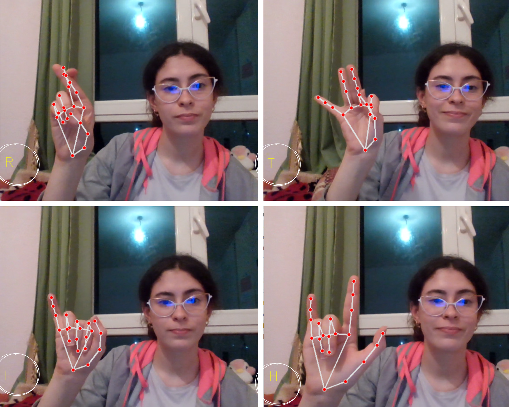

# Sign Language Object Detection using Mediapipe
This notebook is written by: Sandra Mourali, Mariem Ksontini and Eya Ridene.
 
It depicts real-time hand gestures to recognize Sign Language.
 
This notebook is part of our Personal Professional Project assignment at INSAT.
 
Major: Software Engineering (Génie Logiciel 3).
 
University Year: 2022/2023 
 
# Testing our model: 

